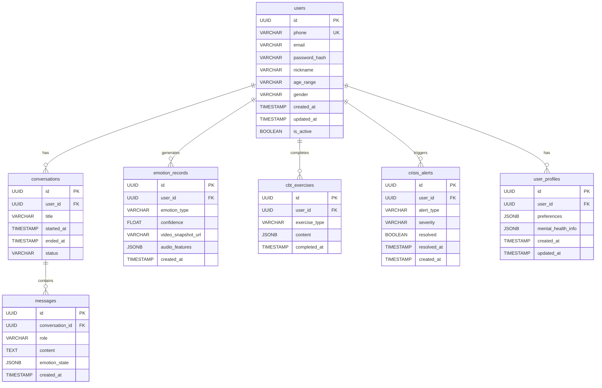

# MindMirror AI - 数据库详细设计文档

**版本**: v1.0  
**日期**: 2026-03-24  
**负责人**: backend-architect  
**状态**: ✅ 已完成

---

## 1. 数据库选型说明

### 1.1 主数据库：PostgreSQL 15+

**选型理由**:
- ✅ 支持 JSONB 数据类型，适合存储情绪状态、音频特征等半结构化数据
- ✅ 强大的索引能力（B-Tree、GIN、GiST），支持复杂查询
- ✅ 事务完整性好，符合医疗数据合规要求
- ✅ 扩展性强，支持分区表、全文搜索等高级特性
- ✅ 开源免费，社区活跃

**部署配置**:
- 主从复制（1 主 2 从）
- 连接池：PgBouncer（最大连接数 500）
- 备份策略：每日全量备份 + WAL 日志实时归档

### 1.2 缓存数据库：Redis 7+

**选型理由**:
- ✅ 高性能（单线程，内存操作）
- ✅ 支持多种数据结构（String、Hash、List、Set、Sorted Set）
- ✅ 持久化支持（RDB + AOF）
- ✅ 发布/订阅模式，适合实时通知

**使用场景**:
- 用户会话缓存（JWT Token 黑名单）
- 高频数据缓存（用户情绪趋势）
- 消息队列（Bull Queue）
- WebSocket 会话管理

---

## 2. 完整 ER 图

### 2.1 实体关系图（Mermaid）



### 2.2 关系说明

| 关系 | 类型 | 说明 |
|------|------|------|
| users ↔ conversations | 1:N | 一个用户可以有多个对话会话 |
| users ↔ emotion_records | 1:N | 一个用户可以有多条情绪记录 |
| users ↔ cbt_exercises | 1:N | 一个用户可以完成多个 CBT 练习 |
| users ↔ crisis_alerts | 1:N | 一个用户可以触发多个危机预警 |
| users ↔ user_profiles | 1:1 | 一个用户对应一个档案 |
| conversations ↔ messages | 1:N | 一个对话会话包含多条消息 |

---

## 3. 详细表结构

### 3.1 用户表 (users)

```sql
CREATE TABLE users (
    id UUID PRIMARY KEY DEFAULT gen_random_uuid(),
    phone VARCHAR(20) UNIQUE NOT NULL COMMENT '手机号（登录账号）',
    email VARCHAR(255) UNIQUE COMMENT '邮箱（可选）',
    password_hash VARCHAR(255) NOT NULL COMMENT '密码哈希（bcrypt）',
    nickname VARCHAR(100) COMMENT '昵称',
    age_range VARCHAR(20) COMMENT '年龄段：18-24/25-34/35-44/45-54/55+',
    gender VARCHAR(20) COMMENT '性别：male/female/other/prefer_not_to_say',
    avatar_url VARCHAR(500) COMMENT '头像 URL',
    timezone VARCHAR(50) DEFAULT 'UTC' COMMENT '时区',
    language VARCHAR(10) DEFAULT 'zh-CN' COMMENT '语言偏好',
    created_at TIMESTAMP DEFAULT CURRENT_TIMESTAMP,
    updated_at TIMESTAMP DEFAULT CURRENT_TIMESTAMP,
    last_login_at TIMESTAMP COMMENT '最后登录时间',
    is_active BOOLEAN DEFAULT true COMMENT '账号是否激活',
    is_deleted BOOLEAN DEFAULT false COMMENT '软删除标记'
);

-- 索引
CREATE INDEX idx_users_phone ON users(phone);
CREATE INDEX idx_users_email ON users(email);
CREATE INDEX idx_users_created_at ON users(created_at);
CREATE INDEX idx_users_is_active ON users(is_active);

-- 触发器：自动更新 updated_at
CREATE OR REPLACE FUNCTION update_updated_at_column()
RETURNS TRIGGER AS $$
BEGIN
    NEW.updated_at = CURRENT_TIMESTAMP;
    RETURN NEW;
END;
$$ language 'plpgsql';

CREATE TRIGGER update_users_updated_at BEFORE UPDATE ON users
    FOR EACH ROW EXECUTE FUNCTION update_updated_at_column();
```

### 3.2 用户档案表 (user_profiles)

```sql
CREATE TABLE user_profiles (
    id UUID PRIMARY KEY DEFAULT gen_random_uuid(),
    user_id UUID UNIQUE REFERENCES users(id) ON DELETE CASCADE,
    preferences JSONB DEFAULT '{}'::jsonb COMMENT '用户偏好设置',
    mental_health_info JSONB DEFAULT '{}'::jsonb COMMENT '心理健康信息（加密存储）',
    risk_level VARCHAR(20) DEFAULT 'unknown' COMMENT '风险等级：unknown/low/medium/high',
    created_at TIMESTAMP DEFAULT CURRENT_TIMESTAMP,
    updated_at TIMESTAMP DEFAULT CURRENT_TIMESTAMP
);

-- 索引
CREATE INDEX idx_user_profiles_user_id ON user_profiles(user_id);
CREATE INDEX idx_user_profiles_risk_level ON user_profiles(risk_level);

-- 触发器
CREATE TRIGGER update_user_profiles_updated_at BEFORE UPDATE ON user_profiles
    FOR EACH ROW EXECUTE FUNCTION update_updated_at_column();
```

### 3.3 对话会话表 (conversations)

```sql
CREATE TABLE conversations (
    id UUID PRIMARY KEY DEFAULT gen_random_uuid(),
    user_id UUID NOT NULL REFERENCES users(id) ON DELETE CASCADE,
    title VARCHAR(255) COMMENT '会话标题（自动生成）',
    started_at TIMESTAMP DEFAULT CURRENT_TIMESTAMP,
    ended_at TIMESTAMP COMMENT '会话结束时间',
    status VARCHAR(20) DEFAULT 'active' COMMENT '状态：active/paused/closed/archived',
    message_count INTEGER DEFAULT 0 COMMENT '消息数量（冗余字段）',
    last_message_at TIMESTAMP COMMENT '最后一条消息时间',
    summary TEXT COMMENT '会话摘要（AI 生成）',
    tags TEXT[] COMMENT '标签数组'
);

-- 索引
CREATE INDEX idx_conversations_user_id ON conversations(user_id);
CREATE INDEX idx_conversations_status ON conversations(status);
CREATE INDEX idx_conversations_started_at ON conversations(started_at);
CREATE INDEX idx_conversations_last_message_at ON conversations(last_message_at);

-- 触发器
CREATE TRIGGER update_conversations_updated_at BEFORE UPDATE ON conversations
    FOR EACH ROW EXECUTE FUNCTION update_updated_at_column();
```

### 3.4 消息表 (messages)

```sql
CREATE TABLE messages (
    id UUID PRIMARY KEY DEFAULT gen_random_uuid(),
    conversation_id UUID NOT NULL REFERENCES conversations(id) ON DELETE CASCADE,
    role VARCHAR(20) NOT NULL COMMENT '角色：user/assistant/system',
    content TEXT NOT NULL COMMENT '消息内容',
    emotion_state JSONB COMMENT '情绪状态快照',
    tokens_count INTEGER COMMENT 'Token 数量',
    model_used VARCHAR(50) COMMENT '使用的 AI 模型',
    latency_ms INTEGER COMMENT '响应延迟（毫秒）',
    created_at TIMESTAMP DEFAULT CURRENT_TIMESTAMP,
    is_deleted BOOLEAN DEFAULT false COMMENT '软删除标记'
);

-- 索引
CREATE INDEX idx_messages_conversation_id ON messages(conversation_id);
CREATE INDEX idx_messages_created_at ON messages(created_at DESC);
CREATE INDEX idx_messages_role ON messages(role);
CREATE INDEX idx_messages_emotion_state ON messages USING GIN(emotion_state);

-- 分区表（按月分区）
CREATE TABLE messages_y2026m03 PARTITION OF messages
    FOR VALUES FROM ('2026-03-01') TO ('2026-04-01');
```

### 3.5 情绪记录表 (emotion_records)

```sql
CREATE TABLE emotion_records (
    id UUID PRIMARY KEY DEFAULT gen_random_uuid(),
    user_id UUID NOT NULL REFERENCES users(id) ON DELETE CASCADE,
    emotion_type VARCHAR(50) NOT NULL COMMENT '情绪类型：happy/sad/angry/fearful/surprised/disgusted/neutral/anxious/depressed',
    confidence FLOAT NOT NULL COMMENT '置信度 (0-1)',
    valence FLOAT COMMENT '效价 (-1 到 1，负向到正向)',
    arousal FLOAT COMMENT '唤醒度 (0 到 1，低到高)',
    video_snapshot_url VARCHAR(500) COMMENT '视频截图 URL（可选）',
    audio_features JSONB COMMENT '音频特征（MFCC 等）',
    facial_features JSONB COMMENT '面部特征（可选）',
    context TEXT COMMENT '上下文（对话摘要）',
    created_at TIMESTAMP DEFAULT CURRENT_TIMESTAMP
);

-- 索引
CREATE INDEX idx_emotion_records_user_id ON emotion_records(user_id);
CREATE INDEX idx_emotion_records_created_at ON emotion_records(user_id, created_at DESC);
CREATE INDEX idx_emotion_records_type ON emotion_records(emotion_type);
CREATE INDEX idx_emotion_records_user_date ON emotion_records(user_id, created_at);

-- 分区表（按月分区）
CREATE TABLE emotion_records_y2026m03 PARTITION OF emotion_records
    FOR VALUES FROM ('2026-03-01') TO ('2026-04-01');
```

### 3.6 CBT 练习记录表 (cbt_exercises)

```sql
CREATE TABLE cbt_exercises (
    id UUID PRIMARY KEY DEFAULT gen_random_uuid(),
    user_id UUID NOT NULL REFERENCES users(id) ON DELETE CASCADE,
    exercise_type VARCHAR(50) NOT NULL COMMENT '练习类型：thought_record/behavioral_activation/cognitive_restructuring/exposure/mindfulness',
    exercise_id VARCHAR(50) NOT NULL COMMENT '练习模板 ID',
    content JSONB NOT NULL COMMENT '练习内容（用户填写的答案）',
    score FLOAT COMMENT '得分（可选）',
    feedback TEXT COMMENT 'AI 反馈',
    duration_seconds INTEGER COMMENT '完成时长（秒）',
    completed_at TIMESTAMP DEFAULT CURRENT_TIMESTAMP,
    mood_before VARCHAR(20) COMMENT '练习前情绪',
    mood_after VARCHAR(20) COMMENT '练习后情绪'
);

-- 索引
CREATE INDEX idx_cbt_exercises_user_id ON cbt_exercises(user_id);
CREATE INDEX idx_cbt_exercises_type ON cbt_exercises(exercise_type);
CREATE INDEX idx_cbt_exercises_completed_at ON cbt_exercises(completed_at DESC);
CREATE INDEX idx_cbt_exercises_user_date ON cbt_exercises(user_id, completed_at);
```

### 3.7 危机预警记录表 (crisis_alerts)

```sql
CREATE TABLE crisis_alerts (
    id UUID PRIMARY KEY DEFAULT gen_random_uuid(),
    user_id UUID NOT NULL REFERENCES users(id) ON DELETE CASCADE,
    alert_type VARCHAR(50) NOT NULL COMMENT '预警类型：suicide_risk/self_harm/severe_depression/panic_attack',
    severity VARCHAR(20) NOT NULL COMMENT '严重程度：low/medium/high/critical',
    trigger_reason TEXT COMMENT '触发原因（关键词/情绪阈值）',
    message_snapshot TEXT COMMENT '触发消息快照',
    emotion_snapshot JSONB COMMENT '情绪状态快照',
    action_taken TEXT COMMENT '采取的行动',
    resolved BOOLEAN DEFAULT false,
    resolved_at TIMESTAMP,
    resolved_by UUID COMMENT '解决者（用户 ID 或管理员 ID）',
    follow_up_required BOOLEAN DEFAULT false COMMENT '是否需要跟进',
    follow_up_completed BOOLEAN DEFAULT false,
    created_at TIMESTAMP DEFAULT CURRENT_TIMESTAMP
);

-- 索引
CREATE INDEX idx_crisis_alerts_user_id ON crisis_alerts(user_id);
CREATE INDEX idx_crisis_alerts_severity ON crisis_alerts(severity);
CREATE INDEX idx_crisis_alerts_resolved ON crisis_alerts(resolved);
CREATE INDEX idx_crisis_alerts_created_at ON crisis_alerts(created_at DESC);
CREATE INDEX idx_crisis_alerts_user_resolved ON crisis_alerts(user_id, resolved);

-- 高严重度预警自动通知（触发器）
CREATE OR REPLACE FUNCTION notify_critical_alert()
RETURNS TRIGGER AS $$
BEGIN
    IF NEW.severity IN ('high', 'critical') THEN
        -- 发送通知到通知服务
        PERFORM pg_notify('crisis_alert', row_to_json(NEW)::text);
    END IF;
    RETURN NEW;
END;
$$ LANGUAGE plpgsql;

CREATE TRIGGER trigger_notify_critical_alert
    AFTER INSERT ON crisis_alerts
    FOR EACH ROW EXECUTE FUNCTION notify_critical_alert();
```

### 3.8 刷新令牌表 (refresh_tokens)

```sql
CREATE TABLE refresh_tokens (
    id UUID PRIMARY KEY DEFAULT gen_random_uuid(),
    user_id UUID NOT NULL REFERENCES users(id) ON DELETE CASCADE,
    token_hash VARCHAR(255) NOT NULL COMMENT 'Token 哈希',
    device_info VARCHAR(255) COMMENT '设备信息',
    ip_address INET COMMENT 'IP 地址',
    expires_at TIMESTAMP NOT NULL,
    revoked BOOLEAN DEFAULT false,
    revoked_at TIMESTAMP,
    created_at TIMESTAMP DEFAULT CURRENT_TIMESTAMP
);

-- 索引
CREATE INDEX idx_refresh_tokens_user_id ON refresh_tokens(user_id);
CREATE INDEX idx_refresh_tokens_token_hash ON refresh_tokens(token_hash);
CREATE INDEX idx_refresh_tokens_expires_at ON refresh_tokens(expires_at);
```

---

## 4. Redis 数据结构设计

### 4.1 会话缓存

```
Key 格式：session:{user_id}
类型：Hash
TTL: 15 分钟
结构：{
    "access_token": "xxx",
    "refresh_token": "yyy",
    "last_activity": "timestamp"
}
```

### 4.2 JWT 黑名单

```
Key 格式：jwt:blacklist:{jti}
类型：String
TTL: Token 剩余有效期
值：1
```

### 4.3 用户情绪趋势（缓存）

```
Key 格式：emotion:trend:{user_id}:{date}
类型：Hash
TTL: 7 天
结构：{
    "dominant_emotion": "anxious",
    "average_valence": -0.3,
    "average_arousal": 0.6,
    "record_count": 15
}
```

### 4.4 WebSocket 会话管理

```
Key 格式：ws:session:{socket_id}
类型：Hash
TTL: 1 小时
结构：{
    "user_id": "uuid",
    "conversation_id": "uuid",
    "connected_at": "timestamp"
}
```

### 4.5 限流计数器

```
Key 格式：ratelimit:{user_id}:{endpoint}
类型：String（计数器）
TTL: 1 分钟
值：请求次数
```

---

## 5. 数据字典

### 5.1 情绪类型枚举

| 值 | 说明 | 中文 |
|----|------|------|
| happy | 快乐 | 高兴、愉悦 |
| sad | 悲伤 | 难过、沮丧 |
| angry | 愤怒 | 生气、恼怒 |
| fearful | 恐惧 | 害怕、担忧 |
| surprised | 惊讶 | 吃惊、意外 |
| disgusted | 厌恶 | 反感、讨厌 |
| neutral | 中性 | 平静、无明显情绪 |
| anxious | 焦虑 | 紧张、不安 |
| depressed | 抑郁 | 消沉、低落 |

### 5.2 风险等级枚举

| 值 | 说明 | 处理策略 |
|----|------|----------|
| unknown | 未知 | 继续观察 |
| low | 低 | 常规关注 |
| medium | 中 | 增加 CBT 练习推荐 |
| high | 高 | 触发预警，通知紧急联系人 |

### 5.3 危机预警类型枚举

| 值 | 说明 | 响应措施 |
|----|------|----------|
| suicide_risk | 自杀风险 | 立即通知紧急联系人 + 心理热线 |
| self_harm | 自我伤害 | 通知紧急联系人 |
| severe_depression | 重度抑郁 | 推荐专业咨询 |
| panic_attack | 惊恐发作 | 提供即时舒缓练习 |

### 5.4 CBT 练习类型枚举

| 值 | 说明 | 目标 |
|----|------|------|
| thought_record | 思维记录 | 识别自动负性思维 |
| behavioral_activation | 行为激活 | 增加积极活动 |
| cognitive_restructuring | 认知重构 | 挑战不合理信念 |
| exposure | 暴露练习 | 逐步面对恐惧 |
| mindfulness | 正念练习 | 提升当下觉察 |

---

## 6. 数据迁移策略

### 6.1 初始迁移

```bash
# 使用 Prisma 或 Knex 进行迁移
npx prisma migrate dev --name init
```

### 6.2 版本控制

- 所有迁移文件保存在 `prisma/migrations/` 目录
- 每个迁移文件包含时间戳前缀
- 生产环境迁移需经过测试环境验证

---

## 7. 备份与恢复

### 7.1 备份策略

| 类型 | 频率 | 保留期 | 存储位置 |
|------|------|--------|----------|
| 全量备份 | 每日 02:00 | 30 天 | S3 + 本地 |
| WAL 归档 | 实时 | 7 天 | S3 |
| 增量备份 | 每小时 | 24 小时 | 本地 |

### 7.2 恢复流程

```bash
# 1. 停止应用
systemctl stop mindmirror-backend

# 2. 恢复数据库
pg_restore -U mindmirror -d mindmirror /backups/latest.dump

# 3. 验证数据
psql -U mindmirror -d mindmirror -c "SELECT COUNT(*) FROM users;"

# 4. 重启应用
systemctl start mindmirror-backend
```

---

## 8. 性能优化

### 8.1 索引优化

- 所有外键字段建立索引
- 高频查询字段建立组合索引
- JSONB 字段使用 GIN 索引

### 8.2 查询优化

- 使用 EXPLAIN ANALYZE 分析慢查询
- 避免 N+1 查询（使用 JOIN 或批量查询）
- 大表使用分区（messages、emotion_records 按月分区）

### 8.3 连接池配置

```yaml
# PgBouncer 配置
[pgbouncer]
pool_mode = transaction
max_client_conn = 1000
default_pool_size = 20
min_pool_size = 5
```

---

## 9. 合规与安全

### 9.1 数据加密

- 密码：bcrypt（cost=12）
- 敏感字段（mental_health_info）：AES-256 加密后存储
- 传输：TLS 1.3

### 9.2 数据脱敏

- 日志中脱敏手机号、邮箱
- 分析数据匿名化处理

### 9.3 数据保留策略

| 数据类型 | 保留期 | 删除方式 |
|----------|--------|----------|
| 用户账号 | 用户主动删除或 2 年未登录 | 软删除→30 天后硬删除 |
| 对话记录 | 1 年 | 归档到冷存储 |
| 情绪记录 | 6 个月 | 匿名化后保留统计 |
| 危机预警 | 3 年（合规要求） | 加密归档 |

---

*文档版本：1.0*  
*创建时间：2026-03-24*  
*负责人：backend-architect*  
*状态：✅ 已完成*
