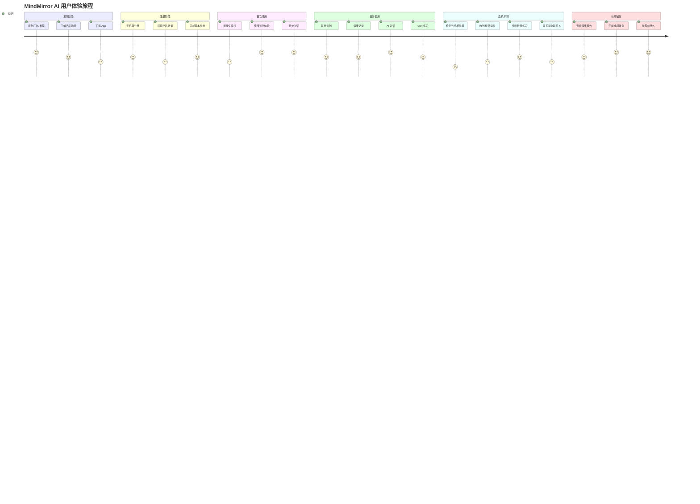

# MindMirror AI - 用户体验旅程地图

**版本**: v1.0  
**日期**: 2026-03-24  
**负责人**: ux-researcher  
**状态**: ✅ 已完成

---

## 1. 用户画像

### 1.1 画像 A: 职场焦虑族 - 李明

| 维度 | 描述 |
|------|------|
| **基本信息** | 男，28 岁，互联网公司产品经理，一线城市 |
| **职业状态** | 工作 3-5 年，中等收入，工作压力大 |
| **心理状态** | 轻度焦虑，偶尔失眠，担心职业发展 |
| **痛点** | - 工作压力大，难以放松<br>- 情绪波动时无人倾诉<br>- 对心理咨询有顾虑（费用高、 stigma） |
| **使用场景** | - 晚上加班后（22:00-24:00）<br>- 周末独处时<br>- 项目压力期 |
| **技术接受度** | 高，习惯使用各类 App |
| **期望** | 快速缓解焦虑，获得情绪支持，学习调节技巧 |
| **代表语录** | "有时候就是想找个说说，但又不想麻烦朋友" |

---

### 1.2 画像 B: 产后抑郁妈妈 - 王芳

| 维度 | 描述 |
|------|------|
| **基本信息** | 女，32 岁，新手妈妈，二线城市 |
| **职业状态** | 产假中，原为教师 |
| **心理状态** | 中度抑郁倾向，情绪低落，自我价值感低 |
| **痛点** | - 照顾婴儿疲惫，缺乏自我时间<br>- 情绪波动大，易怒易哭<br>- 家人不理解，感到孤独 |
| **使用场景** | - 婴儿睡觉时（碎片时间）<br>- 深夜喂奶后<br>- 丈夫不在家时 |
| **技术接受度** | 中，主要使用微信、小红书 |
| **期望** | 被理解、被倾听，获得情绪认同，学习应对方法 |
| **代表语录** | "我觉得自己不是个好妈妈，但我又控制不了情绪" |

---

### 1.3 画像 C: 大学生 - 张小华

| 维度 | 描述 |
|------|------|
| **基本信息** | 男，20 岁，大三学生，三线城市 |
| **职业状态** | 学生，面临就业压力 |
| **心理状态** | 轻度抑郁，社交焦虑，对未来迷茫 |
| **痛点** | - 就业压力大，不知道能做什么<br>- 社交恐惧，难以建立亲密关系<br>- 经济有限，无法承担心理咨询 |
| **使用场景** | - 宿舍独处时<br>- 深夜（23:00-02:00）<br>- 面试/考试前后 |
| **技术接受度** | 高，重度手机用户 |
| **期望** | 免费/低成本支持，匿名倾诉，获得建议 |
| **代表语录** | "我不知道毕业后能干什么，感觉很迷茫" |

---

### 1.4 画像 D: 退休老人 - 陈建国

| 维度 | 描述 |
|------|------|
| **基本信息** | 男，65 岁，退休工人，与子女分居 |
| **职业状态** | 退休，独居 |
| **心理状态** | 孤独感，失落感，轻度焦虑 |
| **痛点** | - 子女不在身边，缺乏陪伴<br>- 退休后生活失去目标<br>- 身体机能下降，担心健康 |
| **使用场景** | - 白天子女上班后<br>- 傍晚散步时<br>- 身体不适时 |
| **技术接受度** | 低，需要简单界面，大字体 |
| **期望** | 有人陪伴聊天，获得健康建议，减轻孤独感 |
| **代表语录** | "孩子们都忙，我一个人待着挺闷的" |

---

## 2. 用户旅程地图

### 2.1 完整旅程（Mermaid）



---

### 2.2 分阶段详细旅程

#### 阶段 1: 发现阶段 (Discovery)

**时间**: 使用前 1-7 天

| 触点 | 用户行为 | 想法/感受 | 痛点 | 机会点 |
|------|---------|----------|------|--------|
| 社交媒体广告 | 看到"AI 心理医生"广告 | "这是什么？靠谱吗？" | 对 AI 心理咨询持怀疑态度 | 强调专业性、隐私保护 |
| 朋友推荐 | 听朋友说"这个 App 挺好用" | "朋友都说好，可以试试" | - | 口碑传播、推荐奖励 |
| 应用商店搜索 | 搜索"心理咨询""情绪管理" | "找个便宜/免费的替代品" | 传统心理咨询费用高 | 突出"免费/低成本"优势 |
| 下载决策 | 查看评分、评论、隐私政策 | "评论不错，隐私政策看起来正规" | 担心数据泄露 | 透明化数据处理说明 |

**情绪曲线**: 好奇 → 怀疑 → 尝试意愿

---

#### 阶段 2: 注册阶段 (Onboarding)

**时间**: 首次使用 2-5 分钟

| 触点 | 用户行为 | 想法/感受 | 痛点 | 机会点 |
|------|---------|----------|------|--------|
| 启动页 | 看到简洁温暖的界面 | "界面挺舒服的" | - | 传递温暖、专业的视觉风格 |
| 手机号输入 | 输入手机号获取验证码 | "需要手机号，会不会泄露？" | 隐私顾虑 | 明确说明数据用途，提供隐私承诺 |
| 验证码输入 | 输入 6 位验证码 | "希望验证码快点到" | 验证码延迟 | 优化短信通道，提供备用方案 |
| 隐私政策 | 阅读/勾选隐私政策 | "太长了，但看起来正规" | 条款过长，难以理解 | 提供简化版摘要，关键条款高亮 |
| 基本信息 | 填写昵称、年龄段、性别 | "年龄段就好，不用具体年龄" | 担心信息过多 | 最小化必填信息，可选信息后置 |
| 首次引导 | 观看功能介绍动画 | "原来可以视频情绪识别" | - | 突出核心功能，激发使用兴趣 |

**情绪曲线**: 期待 → 轻微焦虑 → 安心

**关键指标**:
- 注册完成率: ≥85%
- 平均注册时长: <3 分钟
- 隐私政策阅读率: ≥30%

---

#### 阶段 3: 首次使用 (First Experience)

**时间**: 注册后 5-15 分钟

| 触点 | 用户行为 | 想法/感受 | 痛点 | 机会点 |
|------|---------|----------|------|--------|
| 摄像头授权 | 点击"允许"使用摄像头 | "会保存我的视频吗？" | 隐私担忧 | 明确说明"本地处理，不上传" |
| 情绪识别体验 | 面对摄像头，看到情绪分析结果 | "哇，它说我有点焦虑，挺准的" | 识别不准确 | 提供"反馈纠正"入口 |
| 首次对话 | 输入"我今天感觉不太好" | "它会怎么回应我？" | 担心回应机械 | 展示共情能力，建立信任 |
| AI 回应 | 收到温暖、理解的回复 | "感觉被理解了" | - | 强化"被倾听"体验 |
| 功能引导 | 浏览 CBT 练习、情绪记录等功能 | "这个练习看起来有用" | 功能过多，不知从哪开始 | 提供"新手任务"引导 |

**情绪曲线**: 紧张 → 惊喜 → 信任

**关键指标**:
- 首次对话完成率: ≥75%
- 情绪识别体验率: ≥60%
- 次日留存率: ≥50%

---

#### 阶段 4: 日常使用 (Daily Usage)

**时间**: 第 2 天 - 第 30 天

| 触点 | 用户行为 | 想法/感受 | 痛点 | 机会点 |
|------|---------|----------|------|--------|
| 每日签到 | 打开 App，点击签到 | "连续签到 5 天了" | 忘记签到 | 推送提醒，签到奖励 |
| 情绪记录 | 记录当天情绪状态 | "今天心情比昨天好" | 记录繁琐 | 简化记录流程，一键记录 |
| AI 对话 | 与 AI 倾诉烦恼 | "说完感觉好多了" | 对话不够连贯 | 优化上下文记忆 |
| CBT 练习 | 完成一个思维记录练习 | "这个练习有帮助" | 练习耗时过长 | 提供 5 分钟快速练习 |
| 情绪报告 | 查看周/月情绪报告 | "原来我这周情绪波动这么大" | 报告难以理解 | 提供可视化图表 + 解读 |
| 推送通知 | 收到"该休息了"提醒 | "挺贴心的" | 推送过多 | 个性化推送频率 |

**情绪曲线**: 平稳 → 愉悦 → 依赖

**关键指标**:
- 7 日留存率: ≥40%
- 30 日留存率: ≥25%
- 日均使用时长: ≥10 分钟
- CBT 练习完成率: ≥30%

---

#### 阶段 5: 危机干预 (Crisis Intervention)

**时间**: 触发危机信号时

| 触点 | 用户行为 | 想法/感受 | 痛点 | 机会点 |
|------|---------|----------|------|--------|
| 危机检测 | AI 检测到自杀/自伤关键词 | "它怎么知道的？" | 惊讶、被冒犯感 | 温和表达关心，避免指责 |
| 预警提示 | 看到"我们很担心你"的提示 | "有人关心我" | - | 传递温暖、非评判态度 |
| 舒缓练习 | 跟随 AI 做深呼吸练习 | "呼吸慢慢平稳了" | 情绪激动，难以跟随 | 提供多种舒缓方式选择 |
| 资源推荐 | 看到心理热线、专业咨询推荐 | "原来有这些地方可以求助" | 不知道如何求助 | 提供一键拨打/预约 |
| 紧急联系人 | 选择是否通知紧急联系人 | "要不要告诉家人？" | 犹豫、纠结 | 尊重用户选择，提供建议 |
| 后续跟进 | 第二天收到"你还好吗"问候 | "还有人记得我" | - | 持续关怀，建立信任 |

**情绪曲线**: 危机 → 被关注 → 平静 → 感激

**关键指标**:
- 危机信号识别召回率: ≥90%
- 危机干预成功率: ≥80%
- 后续跟进回复率: ≥50%

---

#### 阶段 6: 长期留存 (Long-term Retention)

**时间**: 第 30 天以后

| 触点 | 用户行为 | 想法/感受 | 痛点 | 机会点 |
|------|---------|----------|------|--------|
| 情绪趋势 | 查看月度/季度情绪趋势 | "这几个月情绪稳定多了" | - | 强化"进步感"，提供成就反馈 |
| 成就徽章 | 获得"连续使用 30 天"徽章 | "我做到了！" | - | 游戏化设计，增强成就感 |
| 个性化推荐 | 收到"你可能需要这个练习"推荐 | "它了解我" | 推荐不准确 | 优化推荐算法 |
| 社区功能 (可选) | 浏览他人分享（匿名） | "原来不止我一个人这样" | 担心隐私 | 严格匿名保护 |
| 专业咨询转介 | 考虑升级为付费专业服务 | "要不要试试人工咨询？" | 费用高、决策困难 | 提供优惠券、首次免费 |
| 推荐他人 | 向朋友推荐 App | "这个真的帮到我了" | - | 推荐奖励机制 |

**情绪曲线**: 满足 → 成就 → 忠诚

**关键指标**:
- 90 日留存率: ≥20%
- 付费转化率: ≥5%
- NPS 净推荐值: ≥40
- 月活用户 (MAU): 稳定增长

---

## 3. 关键触点分析

### 3.1 高影响力触点 (Moments of Truth)

| 触点 | 影响阶段 | 用户期望 | 优化策略 |
|------|---------|---------|---------|
| **首次情绪识别** | 首次使用 | "准不准？" | 确保准确率≥75%，提供反馈入口 |
| **首次 AI 对话** | 首次使用 | "能理解我吗？" | 强化共情表达，避免机械回复 |
| **危机预警** | 危机干预 | "会被评判吗？" | 温和表达关心，提供实际帮助 |
| **情绪报告** | 日常使用 | "对我有帮助吗？" | 提供可操作的洞察和建议 |
| **CBT 练习效果** | 日常使用 | "真的有用吗？" | 设计短平快练习，即时反馈效果 |

---

### 3.2 潜在痛点与优化建议

| 痛点 | 影响用户 | 严重程度 | 优化建议 |
|------|---------|---------|---------|
| 隐私担忧 | 所有用户 | 🔴 高 | 透明化数据处理，提供"本地模式"选项 |
| 识别不准确 | 李明、张小华 | 🟡 中 | 提供"纠正"入口，持续优化模型 |
| 对话不连贯 | 李明、王芳 | 🟡 中 | 增强上下文记忆，支持长对话 |
| 练习耗时过长 | 王芳（碎片时间） | 🟡 中 | 提供 5 分钟快速练习版本 |
| 界面复杂 | 陈建国（老年人） | 🟡 中 | 提供"简洁模式"，大字体、少功能 |
| 推送打扰 | 所有用户 | 🟢 低 | 个性化推送频率，允许用户自定义 |

---

## 4. 情绪曲线

### 4.1 理想情绪曲线

```
情绪强度
   ↑
 5 │                    ★危机干预    ★成就徽章
   │                   /            /
 4 │                  /            /
   │     ★首次对话  /     ★日常使用
 3 │    /         /       /
   │   /   ★注册  /     /
 2 │  /       /  /     /
   │ /   ★发现/     /
 1 │/________/_____/___________________→ 时间
   发现    注册   首次  日常   危机   长期
               使用   使用   干预   留存
```

**关键愉悦点**:
1. **首次情绪识别**: "哇，好准！"（惊喜）
2. **首次 AI 对话**: "被理解了"（共鸣）
3. **危机干预**: "有人关心我"（温暖）
4. **情绪报告**: "原来我进步了"（成就）
5. **成就徽章**: "我做到了！"（自豪）

---

### 4.2 情绪低谷与修复策略

| 低谷点 | 原因 | 修复策略 |
|--------|------|----------|
| 注册流程繁琐 | 填写信息过多 | 最小化必填项，可选信息后置 |
| 情绪识别不准确 | 模型误差 | 提供反馈入口，快速迭代优化 |
| AI 回复机械 | 共情不足 | 优化话术库，增强情感表达 |
| 练习效果不明显 | 期望过高 | 设置合理期望，强调"累积效应" |
| 推送打扰 | 频率过高 | 个性化推送，允许用户自定义 |

---

## 5. 可用性测试计划

### 5.1 测试目标

验证核心流程的可用性和用户体验，发现并修复关键问题。

---

### 5.2 测试任务设计

| 任务编号 | 任务描述 | 成功标准 | 测量指标 |
|----------|---------|---------|---------|
| T01 | 完成注册流程 | 成功注册账号 | 完成率、耗时、错误次数 |
| T02 | 体验情绪识别功能 | 完成一次情绪分析 | 完成率、准确率感知 |
| T03 | 与 AI 进行对话 | 完成 5 轮对话 | 对话轮次、满意度 |
| T04 | 完成一个 CBT 练习 | 提交练习答案 | 完成率、耗时、理解度 |
| T05 | 查看情绪报告 | 找到并理解报告 | 理解度、有用性评分 |
| T06 | 设置紧急联系人 | 成功添加联系人 | 完成率、耗时 |
| T07 | 模拟危机场景 | 触发预警并使用资源 | 识别率、干预效果 |

---

### 5.3 测试参与者

| 用户类型 | 人数 | 招募渠道 |
|----------|------|----------|
| 职场焦虑族 (李明) | 2-3 | 社交媒体、朋友推荐 |
| 产后抑郁妈妈 (王芳) | 2-3 | 母婴社群、医院合作 |
| 大学生 (张小华) | 2-3 | 校园论坛、学生群 |
| 退休老人 (陈建国) | 1-2 | 社区中心、家属推荐 |
| **总计** | **8-12 人** | - |

---

### 5.4 测试流程

```
1. 欢迎与知情同意 (5 分钟)
   ↓
2. 背景访谈 (10 分钟)
   ↓
3. 任务执行 (30-40 分钟)
   - 边做边说 (Think Aloud)
   - 观察记录
   ↓
4. 满意度问卷 (10 分钟)
   - SUS 系统可用性量表
   - NPS 净推荐值
   ↓
5. 深度访谈 (15 分钟)
   - 使用感受
   - 改进建议
   ↓
6. 感谢与报酬 (5 分钟)
```

---

### 5.5 成功指标

| 指标 | 目标值 | 测量方式 |
|------|--------|----------|
| 任务完成率 | ≥85% | 观察记录 |
| 平均任务耗时 | <5 分钟/任务 | 计时 |
| 错误率 | <10% | 错误次数/任务数 |
| SUS 可用性得分 | ≥75 分 | 问卷 |
| NPS 净推荐值 | ≥40 | 问卷 |
| 用户满意度 | ≥4.0/5.0 | 问卷 |

---

### 5.6 测试时间表

| 阶段 | 时间 | 任务 |
|------|------|------|
| 准备期 | 第 1 周 | 招募参与者、准备测试脚本 |
| 执行期 | 第 2 周 | 进行 8-12 场测试 |
| 分析期 | 第 3 周 | 整理数据、输出报告 |
| 优化期 | 第 4 周 | 修复关键问题、迭代设计 |

---

## 6. 附录

### 6.1 术语表

| 术语 | 定义 |
|------|------|
| CBT | 认知行为疗法 (Cognitive Behavioral Therapy) |
| NPS | 净推荐值 (Net Promoter Score) |
| SUS | 系统可用性量表 (System Usability Scale) |
| MAU | 月活跃用户 (Monthly Active Users) |
| P95 | 95 百分位延迟 |

---

### 6.2 参考资源

- **用户体验旅程地图模板**: https://www.nngroup.com/articles/journey-mapping/
- **可用性测试指南**: https://www.usability.gov/how-to-and-tools/methods/usability-testing.html
- **SUS 量表**: https://www.systemusabilityscale.com/

---

*文档版本：1.0*  
*创建时间：2026-03-24*  
*负责人：ux-researcher*  
*状态：✅ 已完成*
